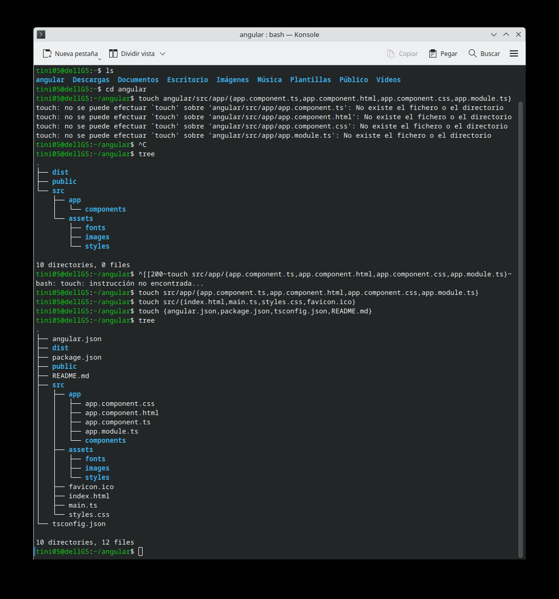

# Practica de comandos de linux
## 1. Titulo
Elaboración de la estructura  de un proyecto Angular con comandos en Linux
## 2. Tiempo de duración
El tiempo aproximado que me tomo en hacer la practica fue de 60 a 90 minuto.
## 3. Fundamentos:
Podemos entender que Angular tiene una estructura muy organizada de las carpetas y los archivos que facilitan su desarrollo y pues, en esta práctica se creará una estructura usando comandos de linux, sin utilizar Angular CLI
Para enteder es importante entender algunos conceptos claves:
- Angular:Herramienta que permite crear configuración y administración de proyectos.
- Estructura: El proyecto creado que contiene diversos archivos y carpetas como Src/, app, assets/ y archivos de configuración etc.
- Comandos de Linux: Se usarán Llo que es mkdir para crear carpetas y touch para poder crear archivos.


## 4. Conocimientos previos.
   
Para poder realizar esta práctica de tener algunos conocimientos previos
- Comandos lux.
- Manejo de terminal
- Conceptos básicos de desarrollo

## 5. Objetivos a alcanzar
   
- Comprende los comandos de Linux 
- Elabora la estructura de un proyecto de Agular
- Poder manipular, archivos y directorios, usando comandos de Linus
  
## 6. Equipo necesario:
  
- Computador con Linux o Windows o máquina virtual.
- Computadora de 16 de RAM dos teras de almacenamiento.
- Sistema operativo Windows 11 tarjeta NVIDIA 40-60.
- Conexión a Internet

## 7. Material de apoyo.
   
- Documentación.
- Comandos básicos de Linux.
- Video de la semana, uno de clase
  
## 8. Procedimiento
### Paso 1 instalamos Ubuntu
Instalamos desde la tienda de Microsoft Ubuntu que es una terminal para ocupar Linux.
### Paso 2 Creamos todas las carpetas 
 Ejecutamos un solo comado para poder crear lo que son todas las carpetas de una sola vez y y tabien con el  nombre del proyecto de anngular con el siguiente comando.
 ```
 mkdir -p angular/{dist,public,src/app/components,src/assets/{images,fonts,styles}}
 ```
 - mkdir -p → Crea directorios y subdirectorios.

- angular/ → Carpeta principal con el nombre.

- dist/ → Archivos generados después de compilar el proyecto.

- public/ → Recursos como imágenes o archivos.

- src/ → Código fuente.

- app/ → Archivos principales.

- components/ → Componentes de Angular.

- assets/ → Imágenes, fuentes y estilos.

- images/ → Imágenes.

- fonts/ → Fuentes.

- styles/ → Archivos adicionales.
### Paso 3 Crear los archivos
Despues de que se creo las carpetas se procede a crear los archivos nesesarios y principales del proyecto con los siguintes comandos.

```
touch angular/src/app/{app.component.ts,app.component.html,app.component.css,app.module.ts}
touch angular/src/{index.html,main.ts,styles.css,favicon.ico}
touch angular/{angular.json,package.json,tsconfig.json,README.md}

```
- touch → Archivos vacíos.

- app.component.ts → Componente principal.

- app.component.html → Componente principal.

- app.component.css → Estilos del componente.

- app.module.ts → Módulo principal.

- index.html → Página HTML.

- main.ts → Punto de entrada aplicación.

- styles.css → Archivo globales.

- favicon.ico → Ícono del sitio.

- angular.json → Configuración del proyecto.

- package.json → Dependencias de Node.js.

- tsconfig.json → Configuración de TypeScript.

- README.md → Documentación del proyecto.
### Paso  4 Verificar Estructura

Para poder verifar la estructura del proyecto y ver si fue bien creado ingresamos el siguente comando.
```
tree

```
Y en lo resultados se puede ver que se creo todo corretamente la estrutura de proyecto.


## 9. Resultados esperados:
    
En los resultados obtenidos se puede observar que se pudo realizar lo que es toda la estructura de un proyecto de angular con comandos de LinuX, como se puede ver en la imagen.


## 10. Audio
 Link: https://voca.ro/1etUPivY2bnt
## 10. Bibliografía
    
- A, D., & A, D. (2023, 29 septiembre). Cómo usar el comando touch de Linux + Ejemplos. ES Tutoriales. https://www.hostinger.com/es/tutoriales/usar-comando-touch-linux-ejemplos 
- Equipo editorial de IONOS. (2023, 10 agosto). Comando mkdir de Linux: para crear nuevos directorios. IONOS Digital Guide. https://www.ionos.com/es-us/digitalguide/servidores/configuracion/comando-mkdir-de-linux/